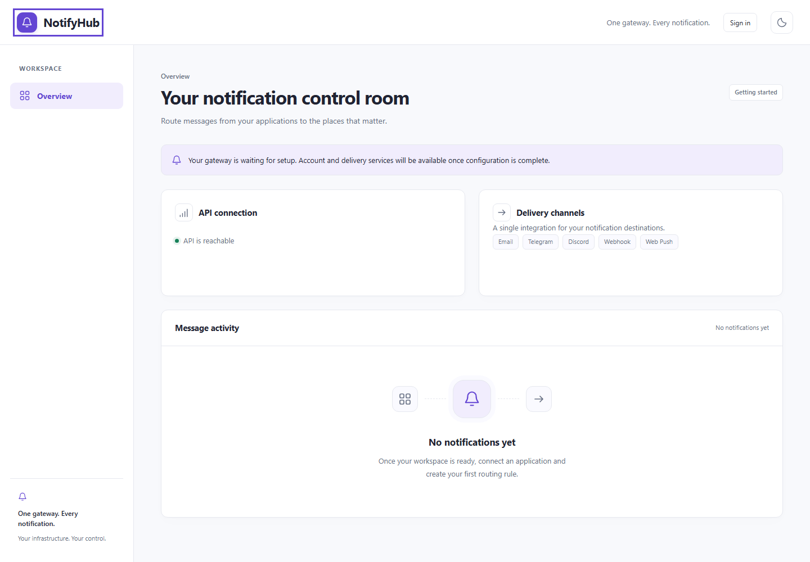
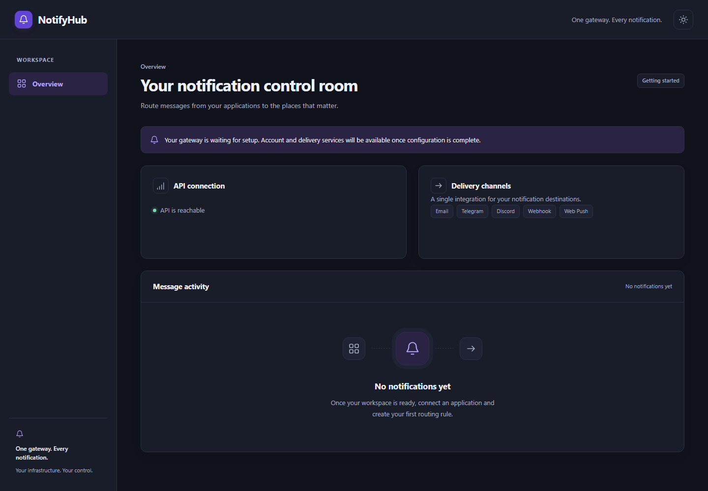

# NotifyHub

A self-hosted notification gateway for accepting application events, routing them
to configured destinations, and tracking delivery across channels.

**Development preview: v1 is incomplete, approximately 15% implemented.**
This repository contains the frontend, backend, tests, database tooling and
project documentation. It is not ready for production notification delivery.

## Planned v1 capabilities

- Accounts, isolated workspaces, membership, permissions and MFA.
- Applications with scoped, rotating and revocable API keys.
- Durable notification ingestion, idempotency and a PostgreSQL delivery queue.
- Routing rules, templates and timezone-aware quiet hours.
- Email, Telegram, Discord, generic webhook and Web Push destinations.
- Retries, dead letters, replay, delivery history and a dashboard.
- Encrypted provider credentials, SSRF protection, audit and retention.
- Observability, Docker Compose, backup/restore and automated verification.

These are planned capabilities. No native mobile application is planned.

## Current implementation

| Area | Available now | Pending |
|---|---|---|
| Architecture | Separate API/worker, Domain/Application/Infrastructure modules, EF aggregate repositories and Unit of Work | Delivery worker |
| PostgreSQL | Three migrations, scoped Dapper projection, restricted roles, transaction/isolation tests | Notification/queue/provider schema |
| Identity | Argon2id hashing, JWT validation, active-session checks, refresh rotation/replay/revocation, protected MFA storage | Bootstrap, login/signup/invite/reset endpoints, refresh cookies, MFA lifecycle/enforcement |
| Workspaces | Persistence, permissions, last-owner protection | Member/workspace APIs, invites and UI |
| Frontend | Responsive light/dark overview, routing, health loading/error/retry, externalized strings, accessibility checks | Authenticated feature screens and notification data |
| Operations | Structured logs, correlation IDs, safe errors, health/readiness, authored CI | Compose, metrics, retention, backup/restore and release gates |

Endpoints currently include /health, /ready and the protected /api/v1/auth/session
probe. Development OpenAPI is at /openapi/v1.json. Public login is not available yet.

[Implementation status](document/Implementation-Status.md) records milestone and
module percentages, actual test results, unresolved issues and next steps.

## UI preview

The UI uses restrained violet/slate colors, consistent spacing, vector icons,
accessible focus states, reduced-motion support and responsive layouts.
Screenshots use mocked health responses and contain no delivery activity.

## Technology and structure

Backend: .NET 10 LTS / ASP.NET Core, EF Core writes and parameterized Dapper reads.
Database: PostgreSQL with distinct migration, write and read credentials.
Frontend: React, TypeScript, Vite and Tailwind CSS.
Tests: xUnit, actual PostgreSQL, Playwright and axe.

Versions are pinned in project files and lockfiles. Tested environment:
.NET SDK 10.0.401/runtime 10.0.12, Node.js 24.11.0/npm 11.6.1,
PostgreSQL 18.6 and Playwright Chromium.

    NotifyHub.slnx
    backend/
      src/
        NotifyHub.Domain/
        NotifyHub.Application/
        NotifyHub.Infrastructure/
        NotifyHub.Api/
        NotifyHub.Worker/
      tests/
    Frontend/                 React application and lockfile
    tests/e2e/                Playwright checks
    scripts/                  Database and test helpers
    deploy/                   SQL migrations and role grants
    document/                 Requirements, design, plan, ADRs and evidence
    .github/                  CI and contribution templates

## Local development

Install the SDK selected by global.json, Node.js and access to a dedicated
disposable PostgreSQL database. Docker is needed for later Compose verification;
Compose deployment has not been implemented or verified.

From the repository root:

    dotnet tool restore
    dotnet restore NotifyHub.slnx --locked-mode
    dotnet build NotifyHub.slnx --no-restore
    dotnet test backend/tests/NotifyHub.UnitTests --no-restore
    npm ci --prefix Frontend
    npm run build --prefix Frontend

Start the API:

    dotnet run --project backend/src/NotifyHub.Api --no-launch-profile --urls http://127.0.0.1:5080

In another terminal:

    cd Frontend
    npm run dev

Vite proxies health/readiness to the local API. Start the worker with:

    dotnet run --project backend/src/NotifyHub.Worker

The worker currently hosts the composition root and does not deliver notifications.

### Database and secrets

Use a dedicated disposable development database. Migration owns the schema;
Write receives reviewed mutation grants; Read selects approved projections only.

Create backend/src/NotifyHub.Api/appsettings.Local.json using the empty
ConnectionStrings structure in appsettings.json. The local file is ignored.
Environment alternatives: ConnectionStrings__Write, ConnectionStrings__Read and
ConnectionStrings__Migration.

Never commit credentials, signing keys, Data Protection keys or provider secrets.
API startup does not migrate automatically. Follow
[Database development](document/Database-Development.md) for explicit migrations,
role setup and isolated PostgreSQL tests.

JWT signing requires an operator-managed private PEM at Security:Jwt:PrivateKeyPath,
minimum RSA 3072 bits. Default issuer/audience: NotifyHub/NotifyHub.Web.
No default signing key or administrator password is provided. Unconfigured
installations cannot authenticate. Bootstrap/key rotation workflows remain pending.

### Tests

After configuring PostgreSQL:

    ./scripts/Test-PostgreSql.ps1

The fixture creates and removes only its own generated schema and checks actual
constraints, rollback, permissions, session races/revocation and MFA storage.

Browser tests:

    cd Frontend
    npx playwright install chromium
    npm run test:e2e

Latest recorded runs passed: 20 unit tests, 8 integration tests at the
PostgreSQL/MFA checkpoint, 17 HTTP checks after JWT wiring, and 5 browser tests.
These overlapping runs are recorded separately in the status document.
No live notifications were sent. Provider contracts and the complete notification
journey are pending. Hosted CI has been authored but not yet verified.

## Project documents

Read these in order:

1. [Requirements and review](document/01-Requirements-and-Review.md)
2. [Software design](document/02-Software-Design.md)
3. [End-to-end development plan](document/03-End-to-End-Development-Plan.md)
4. [Verification and standards](document/04-Verification-and-Standards.md)
5. [Implementation status](document/Implementation-Status.md)

OWASP ASVS Level 2 and IEEE/ISO alignment are documented targets. No certification,
independent security assessment, full conformance or completed production security
verification is claimed.

## Contribution, security and license

See [CONTRIBUTING.md](CONTRIBUTING.md), [SECURITY.md](SECURITY.md) and
[CODE_OF_CONDUCT.md](CODE_OF_CONDUCT.md).

NotifyHub is licensed under **GNU Affero General Public License v3.0 only**
(**AGPL-3.0-only**). See [LICENSE](LICENSE) for the full terms.
Dependency licenses remain governed by their respective terms.
The owner has requested the GitHub source push; external deployment and live
notifications require separate authorization.